

  
  
  
   
   
   
  

<h1 align='middle'><a href='https://botezai.com/'>🏠https://botezai.com/</a></h1>
<h3 align='middle'> 쉽게 만드는 챗봇빌더 플랫폼 EZAI</h3>
                 

✨<strong>직관적이고 단순화</strong>된 챗봇 구축. 
 챗봇 빌더 기능의 👉<strong>선택과 집중</strong>👈  
 하나의 구조로 다양한 플랫폼에 <strong>호환</strong>💯 

---

## 시스템 소개

### 📽시연 동영상
> 아래 영상을 누르면 시연 영상 페이지로 이동합니다.

<a href='https://youtu.be/AShaYbjAqqE' align='middle'>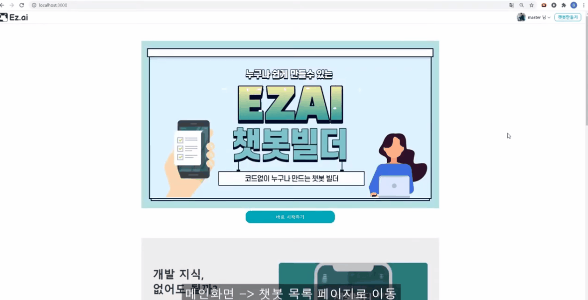</a>

### EZAI란?
> 챗봇(chatbot)을 보다 쉽게 제작할 수 있도록하는 **'챗봇 빌더(Chatbot Builder)' 플랫폼 사이트** 입니다.

### 프로젝트 목표
#### 🌈 쉬운 챗봇 생성
- 만들고 싶은 챗봇의 이름을 정하기만 하면 챗봇 생성이 완료된다.
- 호환이 가능하여 먼저 메신저 플랫폼과 연동하지 않고도 미리 챗봇을 만들어 볼 수 있다.

#### 👨‍👨‍👧직관적이고 친숙한 UI
- 연동하고자 하는 SMS의 인터페이스와 가까운 형태의 UI/UX를 제공함으로써 사용자 친화성을 달성한다.

#### 💻간편한 배포
- 히스토리를 커밋형으로 구현하여 수월하게 버전 관리를 할 수 있도록 하였다.
- 히스토리 상의 배포 버튼을 클릭하여 간편하게 배포할 수 있다.

### 사용기술
- FrontEnd : React
- BackEnd : Express
- Server : Node.js

### 화면 구성 UI
<table>
  <tr>
    <th>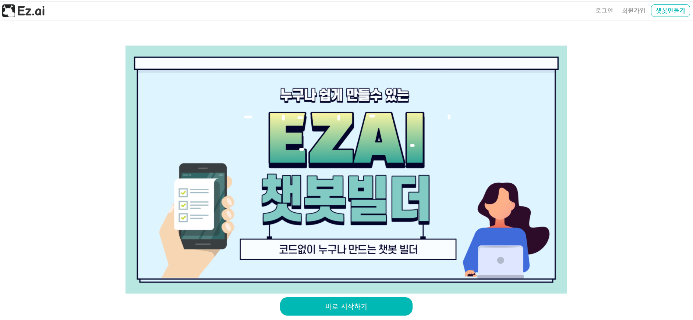</th>
    <th>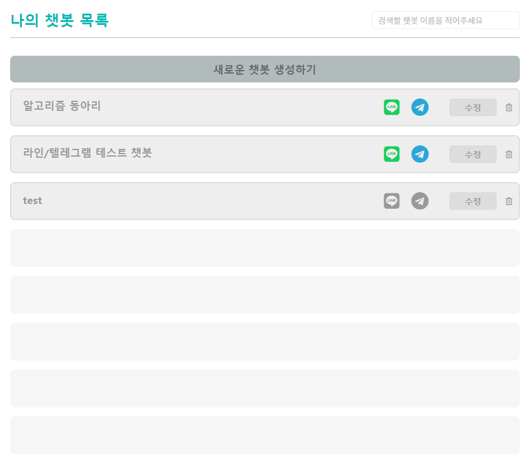</th>
  </tr>
  <tr>
    <td>메인 페이지</td>
    <td>챗봇 목록 </td>
  </tr>
  <tr>
    <td>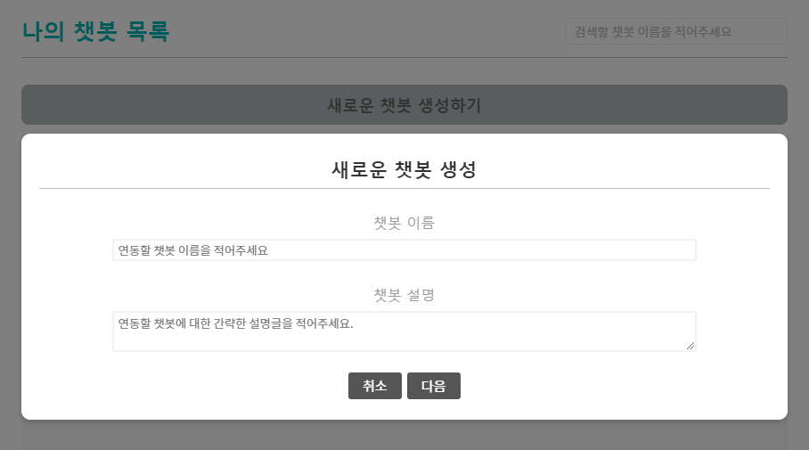</td>
    <td>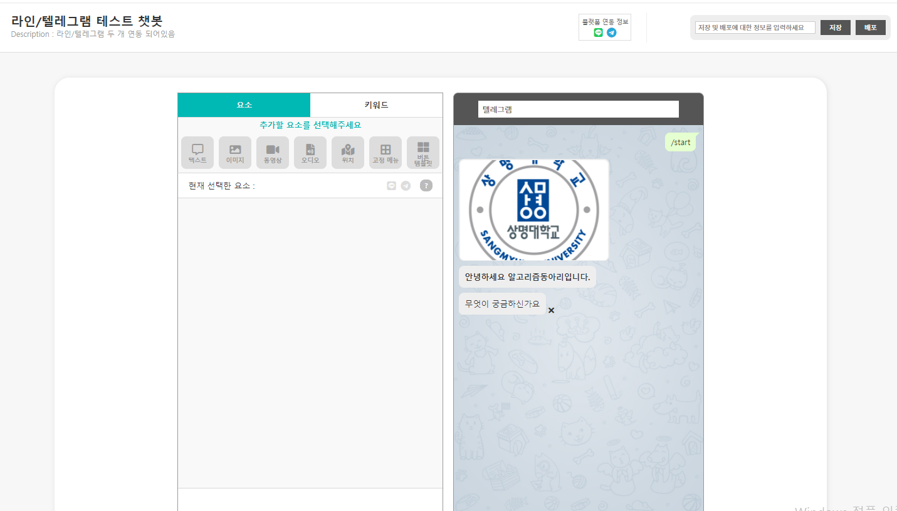</td>
  </tr>
  <tr>
    <td>챗봇 메신저 연동</td>
    <td>챗봇 빌드 페이지</td>
  </tr>
  <tr>
    <td>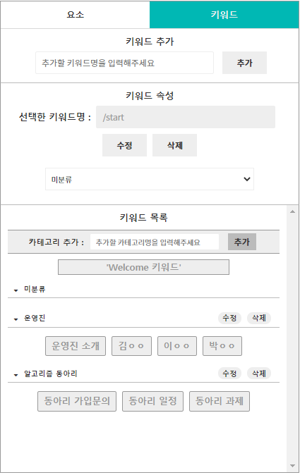</td>
    <td>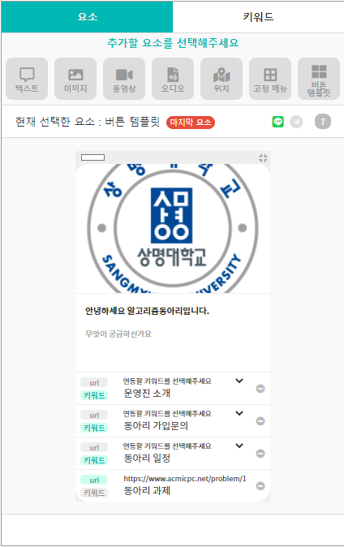</td>
  </tr>
  <tr>
    <td>키워드 탭</td>
    <td>요소 탭</td>
  </tr>
  <tr>
    <td>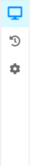</td>
    <td>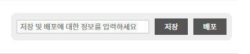</td>
  </tr>
  <tr>
    <td>사이드 바</td>
    <td>저장및 배포</td>
  </tr>
  <tr>    
    <td>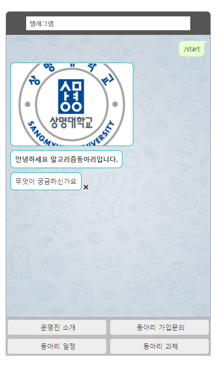</td>
    <td>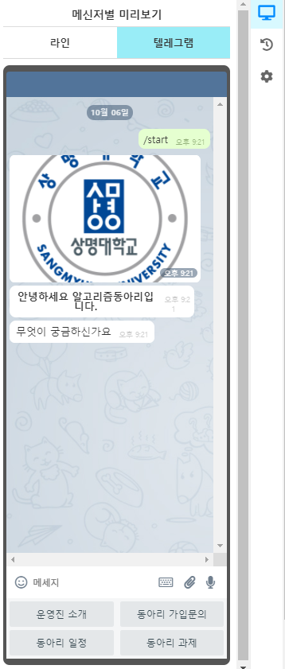</td>
  </tr>
  <tr>
    <td>메인 프리뷰</td>
    <td>미리보기</td>
  </tr>
  <tr>
    <td>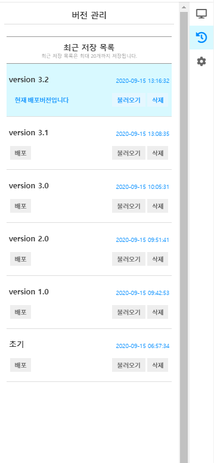</td>
    <td>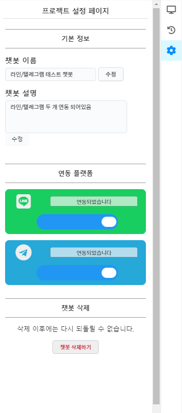</td>
  </tr>
  <tr>
    <td>히스토리</td>
    <td>설정 페이지</td>
  </tr>

</table>

### 시스템 아키텍처

<a href='./docs/system-architecture.png'>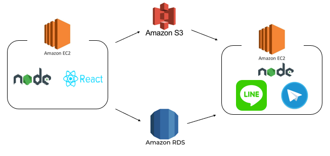</a>

### ER 다이어그램

<a href='./docs/ERDiagrm.png'>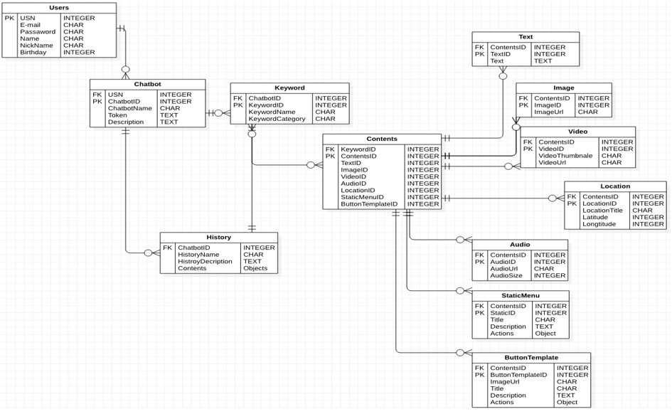</a>

---
## 👨‍👨‍👧팀원 소개
- **2020 상명대학교 졸업 프로젝트 EZ.ai 팀**
> 한창희  
> 최건우  
> 장준영  
> 황현정  
